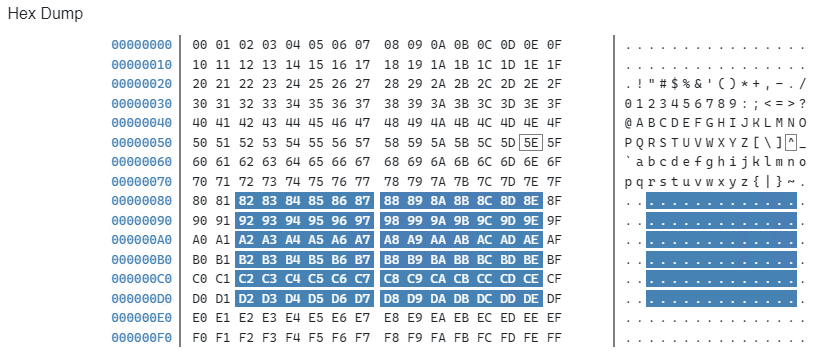

# KzA.Blazor.HexDump

A simple Blazor component to display a hex dump of a byte array.

## Example

## TODO

- [x] Area selection
- [x] Copy to clipboard
- [ ] Value of selected area
- [ ] Styling
- [ ] Editable